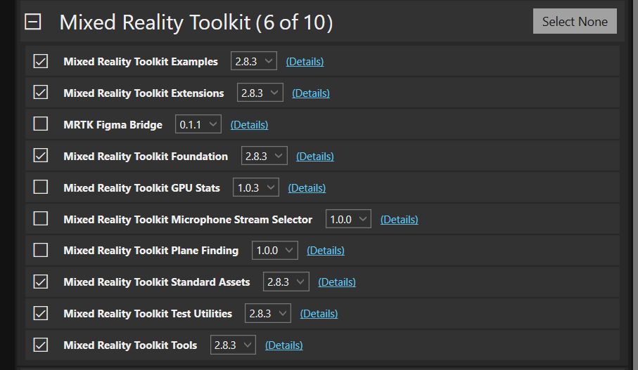
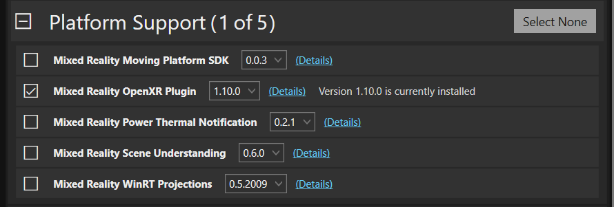

# Gamepad Support for the Hololens 2 with Unity
So you want to be able to use a wireless gamepad with the Hololens 2? The setup is simple but there are a few things to note. The following repository contains a clean working project with controller support ready to go, or you can create your own project by following this guide.

### Requirements
* Gamepad must have HID (Human Interface Device) support
* Gamepad must connect via bluetooth (I have not tested with a USB cable, it may or may not work)
* MRTK 2.8.3 (Have not tested with newer versions)
* Unity 2021.3 LTS

## Create a new Unity Project
Create a new Unity Project using Unity 2021.3 LTS

## Import MRTK
Add MRTK to your project, you will need to enable `show deprecated packages` in the FeatureToolkit settings to install older packages. Get the MRTK Feature Toolkit [here](https://www.microsoft.com/en-us/download/details.aspx?id=102778).

Add the following packages:

## Update Unity Manifest
update this later

## Profit
After following these steps you should be able to recieve gamepad input in your Hololens project. Ensure that the gamepad is connected and working by testing it in the browser app. The gamepad I used for testing was the Gamesir T4 Pro in *Switch Mode*. I would assume this means any regular Switch Pro Controller would work as well.
